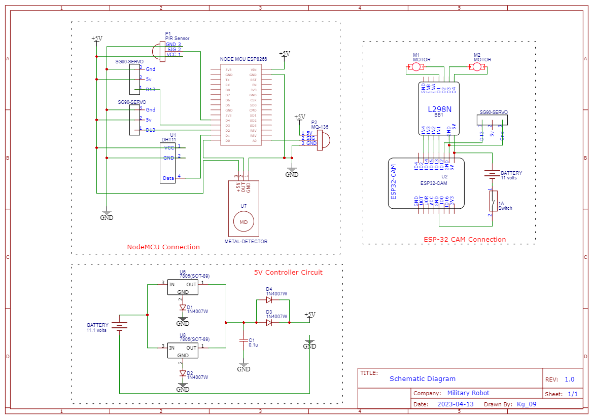
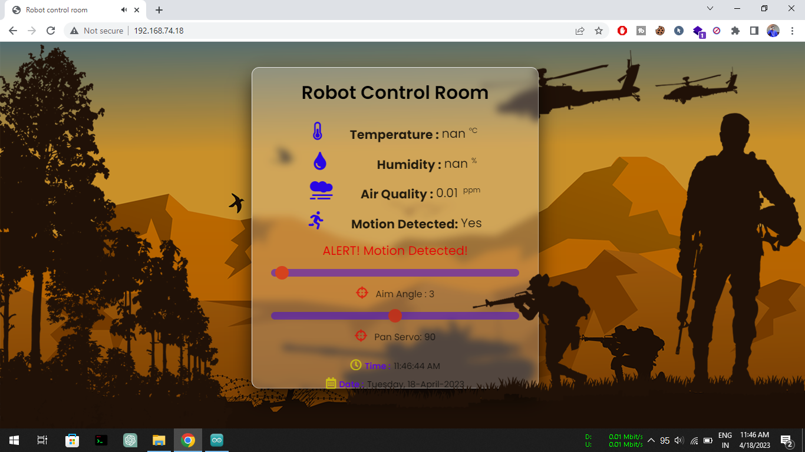

# A MULTIPURPOSE SURVEILLANCE ROBOT FOR MILITARY APPLICATIONS

The Multipurpose Surveillance Robot is an innovative robotic system designed specifically for defense and military applications requiring remote monitoring, environmental data collection, threat detection, and intervention capabilities beyond traditional human-driven approaches.

<video width="1280" height="310"  autoplay loop muted>
  <source src="./assests/robot_360.mp4" type="video/mp4">
</video>
 
 

The robot integrates a variety of sensors, modules, and capabilities into a versatile platform that can be deployed into hazardous environments not suitable for direct human presence. By gathering intelligence and transmitting critical data remotely, the robot aims to boost security and tactical response while removing risks to human life.

## System Architecture

The core of the Multipurpose Surveillance Robot consists of both hardware and software components working in conjunction to enable autonomous and intelligent functionalities.

### Hardware

The key hardware components integrated into the surveillance robot are:

* **NodeMCU ESP8266** - Microcontroller for sensor data acquisition
* **ESP32 Camera Module** - Handling video streaming, object detection and motor control 
* **DHT11 Sensor** - Measuring temperature and humidity
* **MQ135 Sensor** - Measuring air quality and detecting gases
* **Metal Detector** - Detecting presence of metallic objects
* **Motors & Wheels** - Facilitating movement and navigation 
* **Battery Supply** - 11.1V lipo battery with 5V voltage regulator

The interconnections between the modules and sensors above is illustrated in the circuit diagram below: 

### Software

On the software side, the Multipurpose Surveillance Robot utilizes: 

* **Arduino IDE** - For programming the ESP8266 & ESP32 microcontrollers
* **TensorFlow** - Machine learning framework for visual data analysis
* **Android App** - For real-time video streaming and status monitoring
* **Local Web Server** - To display sensor readings for better insights

## Working Principle

The working principle of the surveillance robot involves two simultaneous processes:

**I. Environmental Data Acquisition & Monitoring**

Multiple sensors like DHT11, MQ135 etc. are interfaced to the NodeMCU ESP8266 module in order to detect ambient environmental conditions. The sensor data consisting of critical parameters like temperature, humidity and air contaminants is acquired and processed by the NodeMCU. This data is transmitted wirelessly over WiFi to a local web server which displays the readings on a simple yet intuitive dashboard. Operators can thus monitor environmental conditions around the robot in real time.

**II. Video Streaming & Visual Data Analysis** 

The onboard ESP32 Camera Module acts as the eyes for the intelligent robot. It captures video footage of the robot's surroundings via an integrated 2MP camera and streams it wirelessly over WiFi to the Android application installed on the operator's remote device. Operators have complete view over the robot's field of vision via the live video feed along with the ability to control the robot's wheels remotely via the app. 

Additionally, the ESP32 Cam analyzes the live video feed in real-time by running TensorFlow object detection models trained on the COCO dataset. This cutting-edge neural network enables auto-identification of over 80 different object categories - most crucially humans. The operator can thus not only view raw video footage, but also receive smart analysis to detect threats and intrusions.

## Capabilities

The Multipurpose Surveillance Robot demonstrates the following capabilities making it highly versatile and technology advanced for security roles:

* **All-Terrain Navigation & Control** - Navigate through harsh environments
* **Remote Video Streaming & Monitoring** - FPS live video feed via app  
* **Sensor-Based Environmental Data** - Temperature, humidity and gas analysis
* **AI-Enabled Object Classification** - Detect and recognize threats in video  
* **Trigger-Based Response Actions** - Automated responses to threats if required
* **Cloud-Based Monitoring** - Data logging and monitoring from a portal
* **Semi-Autonomous Functioning** - Pre-configured area scans and actions

## Development Testing 

The robot was tested extensively in indoor and outdoor environments during development:   

**Movement Testing**

The robot chassis and control systems were tested for smooth and reliable navigation over various terrains:

**Sensor Testing** 

The accuracy and reliability of integrated sensors and data acquisition was validated:

**Object Detection Testing**

The object detection model was tuned using the COCO dataset to reliably identify humans and threats:

 

## Conclusion

The Multipurpose Surveillance Robot implements a versatile hardware-software platform to enable next-gen environmental reconnaissance and threat detection capabilities using IoT and ML innovations. With continuous improvements, the project aims to deliver an advanced robotic solution that improves defense response and saves human lives by entering high-risk zones on the soldiers' behalf. This novel solution hopes to modernize surveillance and tactical response by integrating intelligent and autonomous robotics for national security.

## Resources

Android app : https://play.google.com/store/apps/details?id=com.p4f.esp32camai

video tutorial : [coming soon]()

Special thanks to [Longpth](https://github.com/longpth/ESP32CamAI)
